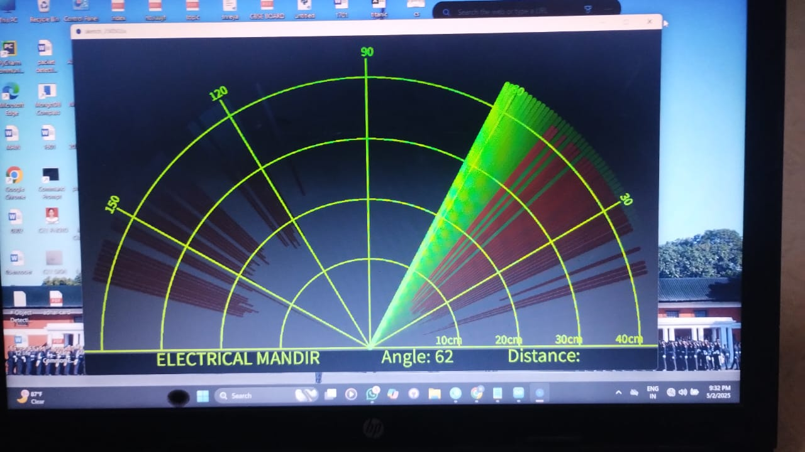

# Arduino Radar System 🚨

A radar-style object detection system using an ultrasonic sensor and servo motor. Visualized in real-time using the Processing IDE with green radar sweep and red blips for nearby obstacles.

## 🔧 Components Used
- Arduino Uno (or compatible)
- HC-SR04 Ultrasonic Sensor
- SG90 Servo Motor
- Breadboard & Jumper Wires
- Processing IDE (for visualization)

## 📐 How It Works
- The servo sweeps from 15° to 165° and back.
- The HC-SR04 sensor measures distance at each angle.
- Data is sent via Serial to the Processing sketch.
- The radar UI displays:
  - Green sweeping line
  - Red blip if an object is within a set threshold (e.g., 20 cm)
  - 

assets/WhatsApp Image 2025-05-02 at 21.33.01 (1).jpeg
## 💻 Project Structure
```

arduino-radar-system/
├── Arduino\_Code/
│   └── radar\_system.ino
├── Processing\_Visualization/
│   └── radar\_visual.pde
├── assets/
│   └── circuit\_diagram.png
└── README.md

```

## 🖥️ Serial Output Format
Each line:  
`angle,distance.`  
Example:  
`45,18.`

## 📊 Detection Threshold
Objects within **20 cm** trigger a red alert on the radar screen.

## 📷 Circuit Diagram
*(Insert image in the `assets/` folder or link to a Fritzing diagram if available)*

## 🚀 Future Enhancements
- Add sound/buzzer alert for detected objects
- Display angle & distance on an OLED screen
- Save detection logs with timestamps

## 📸 Preview


## 📜 License
MIT License

---

Made with ❤️ using Arduino & Processing
